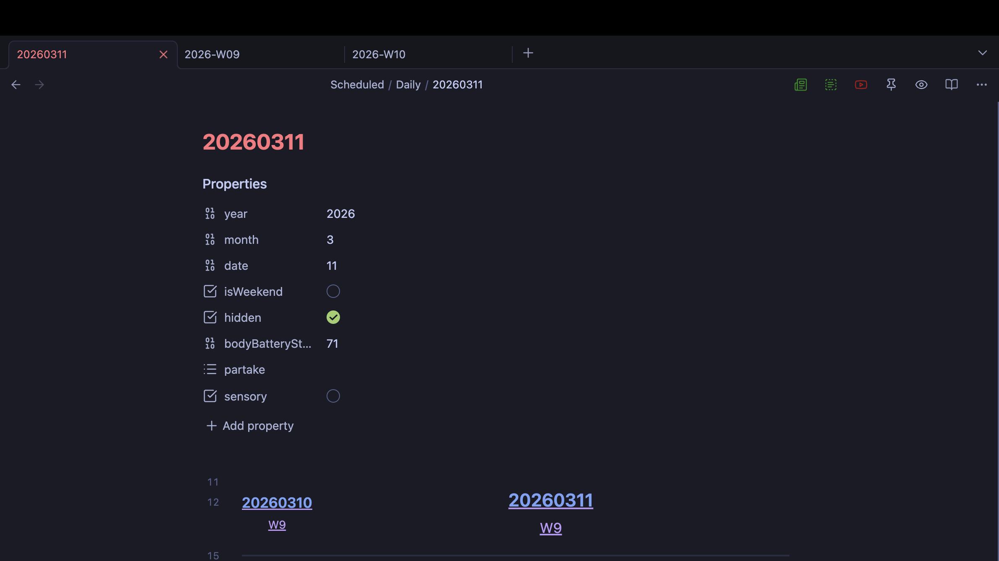

# Date Carousel

This adds a carrousel view using DataViewJs [Views](https://blacksmithgu.github.io/obsidian-dataview/api/code-reference/#dvviewpath-input).  This particular component is designed to act as navigation for daily notes.

## Requirements

- **DataView Plugin** - You will need the Dataview plugin installed and enabled to use this view.  This is required to query the notes and render the carousel.
- **Daily Notes with Frontmatter** - The carousel relies on specific frontmatter fields to identify and sort daily notes.  Each note must have the `year`, `month`, and `date` fields properly set.
- **Note Organization** - All daily notes should be stored in a single folder as the carousel queries that folder to find the notes to display.  The folder path can be configured in the code.

### Frontmatter Fields

Each daily note must have the following fields in the frontmatter:

- **`year`** (number) - The year of the daily note
- **`month`** (number) - The month (1-12)
- **`date`** (number) - The day of the month

These fields are used to:
- Filter and identify daily notes in the folder
- Sort notes chronologically
- Calculate the week of year displayed in the carousel