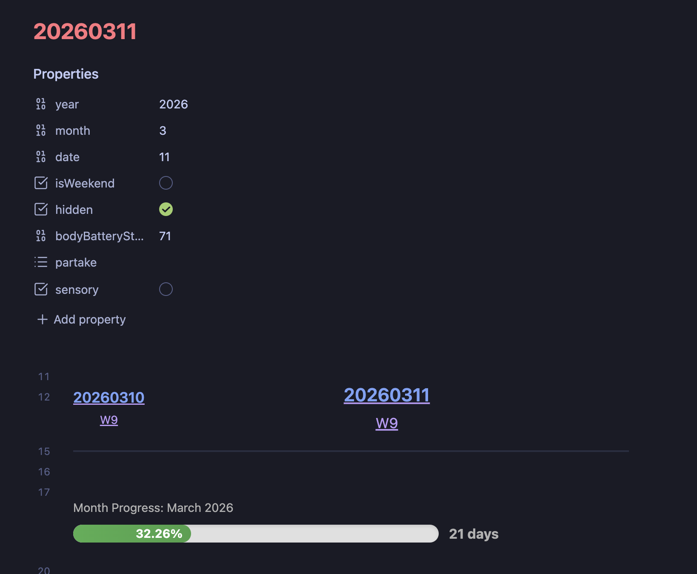

# Month Progress

This adds a visual progress bar using DataViewJs [Views](https://blacksmithgu.github.io/obsidian-dataview/api/code-reference/#dvviewpath-input). This component displays the current month's progress with a percentage bar and the number of days remaining.



I primarily designed this component so that I could easily see how much time was left in the month.  I use this to track my usage of AI token usage across the month to help me decided if I need to slow down or if I have room to experiment more.  It also just helps me be more aware of time in general which is something I want to be more mindful of.

## Requirements

- **DataView Plugin** - You will need the Dataview plugin installed and enabled to use this view. This is required to render the progress bar.
- **Notes with Date Frontmatter** - The progress bar relies on specific frontmatter fields to calculate the month progress. Each note must have the `year`, `month`, and `date` fields properly set.

### Frontmatter Fields

Each note using this view must have the following fields in the frontmatter:

- **`year`** (number) - The year of the note
- **`month`** (number) - The month (1-12)
- **`date`** (number) - The day of the month

These fields are used to:
- Calculate the current date from the note
- Determine the total days in the month
- Calculate the percentage of the month that has elapsed
- Count the remaining days in the month

## Usage

Add the following DataViewJS code block to your note:

```dataviewjs
await dv.view("path/to/month-progress/view");
```

Replace `path/to/month-progress/view` with the actual path to the view file.

### Optional Arguments

You can pass optional configuration arguments to customize the behavior:

```dataviewjs
await dv.view("path/to/month-progress/view", { includeWeekends: false });
```

**Available Arguments:**
- **`includeWeekends`** (boolean, default: `true`) - When `true`, counts all calendar days. When `false`, counts only weekdays (Monday-Friday)

## Features

- **Visual Progress Bar** - Shows a filled progress bar indicating how much of the month has elapsed
- **Percentage Display** - Shows the percentage within the progress bar (when space allows)
- **Days Remaining** - Displays the number of days left in the current month
- **Month Label** - Shows the month name and year above the progress bar
- **Configurable Day Counting** - Choose to count all days or only weekdays via the `includeWeekends` argument (defaults to all days)

## Customization

The month progress view can be customized by passing configuration arguments when calling the view:

```dataviewjs
await dv.view("path/to/month-progress/view", {
  includeWeekends: false  // Count only weekdays (Monday-Friday)
});
```

**Configuration Options:**
- **`includeWeekends`** (boolean, default: `true`) - Controls whether to count all calendar days or only weekdays in the progress calculation

## Styling

The view uses the following CSS classes for styling:
- `.month-progress-container` - Main container for the entire component
- `.progress-label` - The month and year label above the bar
- `.progress-bar-wrapper` - Container for the progress bar and days remaining
- `.custom-progress-bar` - The progress bar background
- `.progress-bar-fill` - The filled portion of the progress bar
- `.progress-percentage` - The days remaining display

Add custom CSS to `view.css` to modify the appearance of the progress bar.
